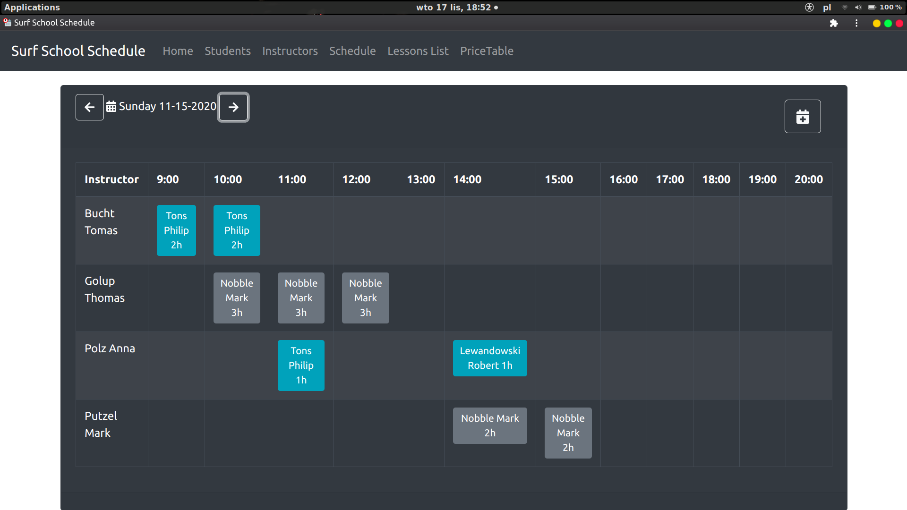

# Surf-School-Schedule
This webapp enables it's user to manage surfing school from the office side

https://surfschoolschedule.netlify.app/
(At first open, App may need to be reloaded a couple of times to print data base elements)

Functionalities:
  1. Add/Edit/Delete Students, Instructors and Price Tables.
  2. Display list of all Students, Instructors and Price Tables.
  3. Display clickable schedule for chosen date:
    - if lesson's color is grey - lesson has not been given yet (status - To_Give)
    - if lesson's color is blue - it has already been given and market as Finished.
  4. After clicking on a free spot in the schedule user can add new lesson with specific Instructor.
  5. Clicking on the occupied spot enables the user to edit/delete the lesson or mark it as given.
  6. Settling Instructors (weekly) - app counts how many lessons specific instructor gave in a chosen week and counts his weekly wage due to their hourly wage. Then marks this week as settled.
  7. Settling Students - app counts how many unpaid lessons specific student has to settle. App automaticaly chooses the price due to the price table and nr of lessons, that student has already had. It also lets the user choose another price option and dicount or insert it on their own.
  
Technologies:
  Backend:
    1. Java, Spring Boot, JPA (H2)
  Frontend:
    2. JavaScript, React, ReactBootstrap, Redux
    
    

    
 
 
